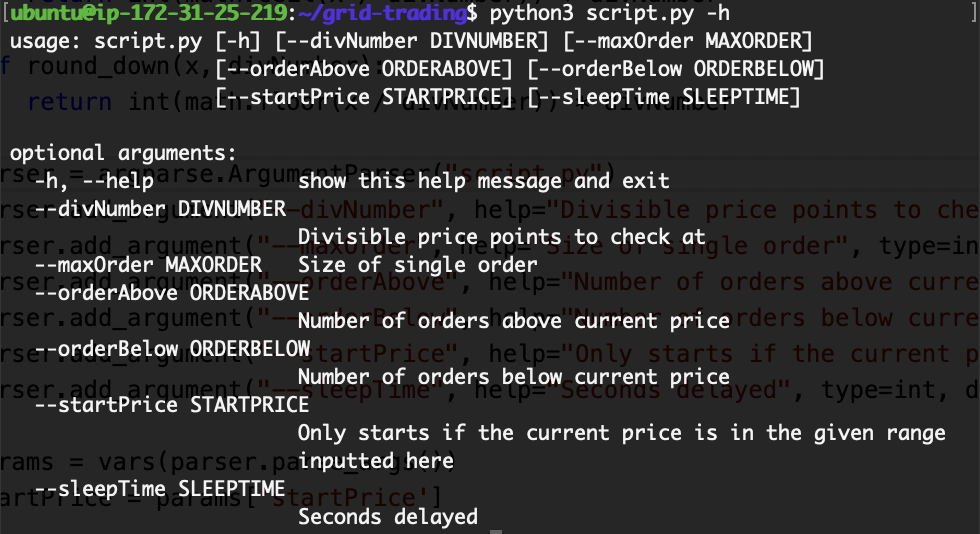

## Instruction:
1) ssh into the server
2) screen -r -d grid


**Sample Input:**
```python3 main.py --maxPositionSize 500 --sizePerOrder 10 --timeframe 10000000 --sleepTime 15 --divNumber 10```

To detach:
3) Ctrl A + d


### To remove all orders:
python3 remove_orders.py